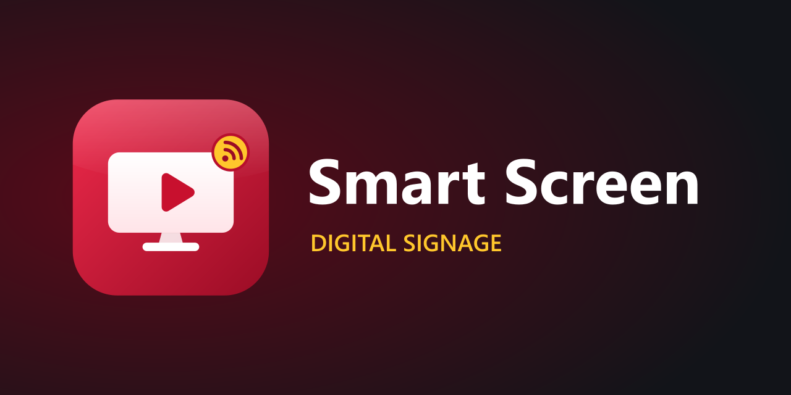

# Smart Screen – Digital Signage për restorante dhe biznese

Sistem për shfaqjen e reklamave, fotove të ushqimeve, videove, menuve me çmime dhe njoftimeve në TV
(si ekranet në KFC, Hesburger, McDonald's). Punon në TV të markave dhe madhësive të ndryshme.

| Pjesa | Teknologjia | Dosja |
|---|---|---|
| **Backend / API** | ASP.NET Core 9, Entity Framework Core, JWT, Swagger | `backend/SmartScreen.Api` |
| **Databaza** | SQLite (parazgjedhje) ose SQL Server | `smartscreen.db` / SQL Server |
| **Frontend** (paneli i menaxhimit) | React + TypeScript + Vite | `frontend/` |
| **Player për TV** | HTML/CSS/JS (ES5) – punon edhe në TV të vjetër | `backend/SmartScreen.Api/wwwroot/player` |
| **Aplikacione TV** | LG webOS, Samsung Tizen, Android TV / Sony | `tv-apps/` |

## Nisja e shpejtë

### 1. Backend-i (.NET)
Hapni `backend/SmartScreen.sln` në Visual Studio dhe shtypni **F5**, ose:
```bash
dotnet run --project backend/SmartScreen.Api
```
- Swagger: **http://localhost:5080/swagger**
- Databaza krijohet automatikisht me të dhëna demo (menu burgerash + playlist).
- Hyrja: **admin / Admin123!** (ndryshojeni te Cilësimet).

### 2. Frontend-i (React)
```bash
cd frontend
npm install
npm start
```
Hapet **http://localhost:5173** (thirrjet `/api` shkojnë te backend-i në portin 5080).

Për prodhim: `npm run build` → frontend-i vendoset në `backend/SmartScreen.Api/wwwroot/app`
dhe shërbehet direkt nga .NET në **http://localhost:5080/**.

### 3. Lidhja e një TV-je
1. Në TV hapni `http://<IP-e-serverit>:5080/player/` (ose aplikacionin nga `tv-apps/`).
2. TV-ja shfaq një **kod 6-shifror**.
3. Në panel: **Ekranet → Shto ekran**, vendosni kodin dhe zgjidhni playlist-ën.

> TV-ja dhe serveri duhet të jenë në të njëjtin rrjet. Lejoni portin 5080 në Windows Firewall.

## Struktura e frontend-it
```
frontend/src/
├── main.tsx              # Rrugët (routes)
├── api.ts                # Thirrjet te API-ja + token JWT
├── types.ts              # Tipet TypeScript (si DTO-të në .NET)
├── styles.css
├── components/           # Layout, Modal, MediaPicker, ScreenPreview
└── pages/                # Dashboard, Screens, Media, Playlists, PlaylistEditor, Menu, Settings, Login
```

## Çfarë mund të bëni
- **Ekranet** – çiftim me kod, statusi online/offline, platforma dhe rezolucioni i zbuluar automatikisht,
  orientim horizontal/vertikal, rifreskim në distancë.
- **Orare** – p.sh. menuja e mëngjesit 07:00–11:00, oferta e drekës 12:00–15:00 (sipas ditëve të javës).
- **Foto & Video** – ngarkim me drag & drop (deri 1 GB, rekomandohet MP4 H.264).
- **Playlistat** – slide: Foto, Video, Menu me çmime, Tekst/Njoftim, Faqe web; renditje, kohëzgjatje,
  **preview live** në rezolucione të ndryshme (720p, 1080p, 4K, vertikal).
- **Menuja** – kategori, produkte, çmime, oferta (çmim i vjetër → % zbritje), "E mbaruar" me një klik.
- **Cilësimet** – emri, logo, ngjyrat e markës, monedha, ora, shiriti i lajmeve, zona kohore.

Player-i kontrollon serverin çdo 15 sekonda; ndryshimet shfaqen pa rinisur TV-në. Nëse bie interneti,
vazhdon të luajë përmbajtjen e fundit të ruajtur.

## Përdorimi i SQL Server
Te `backend/SmartScreen.Api/appsettings.json`:
```json
"Database": { "Provider": "SqlServer" },
"ConnectionStrings": { "SqlServer": "Server=localhost;Database=SmartScreen;Trusted_Connection=True;TrustServerCertificate=True" }
```
Tabelat krijohen automatikisht në nisje.

## Aplikacionet për TV (`tv-apps/`)
Në të gjitha, ndryshoni `SERVER_URL` me IP-në e serverit.

| TV | Si |
|---|---|
| **LG (webOS)** | `tv-apps/lg-webos` – ikonat dhe splash-i janë gati; `ares-package` + `ares-install` (webOS CLI). |
| **Samsung (Tizen)** | `tv-apps/samsung-tizen` – hapeni në Tizen Studio (ikona 512×423 është gati), ndërtoni `.wgt` dhe instalojeni në TV (Developer Mode). |
| **Android TV / Sony Bravia / TV Box** | `tv-apps/android-tv` – hapeni në Android Studio → Build APK. Niset vetë kur ndizet TV-ja. |
| **Çdo TV tjetër / monitor me PC** | Hapni `http://<IP>:5080/player/` në shfletues në ekran të plotë (F11 / kiosk mode). |

## Logo dhe ikonat
- Burimi: `frontend/public/logo.svg` (vektor, shkallëzohet pa humbur cilësi).
- Ngjyrat: e kuqe `#c8102e`, e verdhë `#ffc72c`, sfond i errët `#121419`.

## Publikimi (Publish)
Backend-i dhe frontend-i publikohen **bashkë si një aplikacion**: gjatë publish ndërtohet automatikisht React-i
dhe vendoset në `wwwroot/app`.

```powershell
.\publish.ps1                    # -> .\publish  (serveri duhet të ketë ASP.NET Core 9 Runtime)
.\publish.ps1 -SelfContained     # përfshin .NET brenda (s'ka nevojë për instalim)
```
Ose në Visual Studio: klik i djathtë te **SmartScreen.Api → Publish → Folder**.

**Në IIS (Windows Server):**
1. Instaloni [ASP.NET Core 9 Hosting Bundle](https://dotnet.microsoft.com/download/dotnet/9.0) dhe rinisni IIS (`iisreset`).
2. Kopjoni dosjen `publish` në server (p.sh. `C:\inetpub\SmartScreen`).
3. IIS Manager → Add Website → Physical path = dosja, Port = 5080. Application Pool: **No Managed Code**.
4. I jepni Application Pool-it (`IIS AppPool\SmartScreen`) leje **Modify** mbi dosjen (për `smartscreen.db` dhe `uploads`).
5. Hapni portin në Firewall.

**Pa IIS:** në dosjen `publish` nisni `SmartScreen.Api.exe` (dëgjon në `http://0.0.0.0:5080`).

**Përditësimet:** kur publikoni sërish në të njëjtën dosje, `smartscreen.db` dhe `uploads/` nuk preken. Mos zgjidhni
"Delete all existing files" në Visual Studio, ose ruani një kopje të tyre para publikimit.

## Siguria në prodhim
- Ndryshoni `Jwt:Key` dhe fjalëkalimin e adminit te `appsettings.json`.
- Përdorni HTTPS (p.sh. pas IIS ose Nginx).
